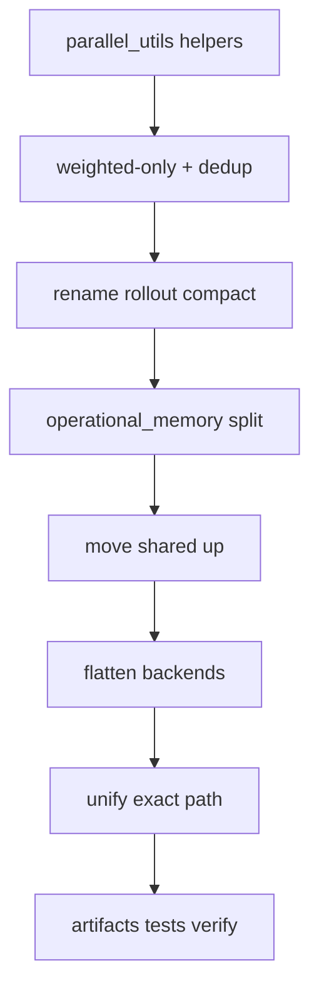

# Operational memory package refactor

## Goals

1. **Clear layout (Option C):** protocol vs backends vs shared helpers.
2. **`operational_memory/`** — split-cut V-matrix protocol (package name; not a single `probe.py` module).
3. **`memory/shared/`** — single shared layer (`encoding`, `utils`, `metrics`); retire `combs/core/`. Named `shared` to avoid confusion with `mqt.yaqs.core`.
4. **`memory/backends/`** — three representations; **no `combs/` wrapper**.
5. **`backends/exact.py`** — MCWF/TJM reference path (not `hamiltonian.py`; avoids `mqt.yaqs.core.data_structures.hamiltonian`).
6. **Weighted-only** memory matrix assembly.
7. **Compact verb-first names**; no `rollout` in API.
8. **Shared parallel dispatch** in `mqt.yaqs.core.parallel_utils` where generic.
9. **Keep probe naming** — `ProbeSet`, `sample_probes`, `evaluate_probes_weighted`, `probe_set=`, etc. (from prior verb-first pass).

**Unchanged (user-facing):** `MemoryCharacterizer` public methods, `CharacterizationResult` noun accessors (`entropy`, `rank`, `probes`, …), `probe_set=` kwarg on `characterize()`, class names `DenseComb`, `TransformerComb`, `ProbeSet`.

---

## Target layout

```
src/mqt/yaqs/characterization/memory/
  __init__.py
  operational_memory/
    __init__.py
    interventions.py      # from top-level interventions.py
    samples.py            # ProbeSet, sample_probes, step sampling
    grid.py               # assemble_probe_sequence, assemble_probe_grid
    branch_weights.py     # compute_born_prob, compute_branch_weight(s)
    memory_matrix.py      # weighted assembly + compute_spectrum only
    results.py            # CharacterizationResult, pack/merge helpers
    run.py                # OperationalMemoryBackend, run_operational_memory
  shared/                 # was combs/core/
    encoding.py
    utils.py
    metrics.py
  backends/
    exact.py              # was reference/exact.py
    tomography/           # was combs/tomography/
    surrogates/           # was combs/surrogates/
      workflow.py         # slimmer after worker extract + simulate merge
      workers.py          # new: pool workers
      model.py
      data.py             # SeqTrace, stack_traces
      utils.py
```

Delete after migration: `diagnostics/`, `reference/`, `combs/`, top-level `interventions.py`.

Tests mirror: `tests/characterization/memory/operational_memory/`, `.../shared/`, `.../backends/`.

---

## Naming

### Probe terminology (keep)

| Symbol | Notes |
|--------|-------|
| `ProbeSet` | Dataclass; unchanged |
| `sample_probes` | Verb-first; unchanged |
| `assemble_probe_sequence`, `assemble_probe_grid` | Unchanged |
| `evaluate_probes`, `evaluate_probes_weighted` | Backend protocol; unchanged |
| `map_probe_kwargs`, `resolve_probe_bundle` | `memory_characterizer` helpers; unchanged |
| `probe_set=` / `CharacterizationResult.probes()` | Public API; unchanged |

### Operational-memory orchestration (rename module only)

| Current | Proposed |
|---------|----------|
| `run_probe_diagnostics` | `run_operational_memory` |
| `_ProbeProcess` | `OperationalMemoryBackend` |

### Exact backend

| Current | Proposed |
|---------|----------|
| `ExactProbeProcess` | `ExactBackend` |
| `simulate_probes_exact` | `simulate_exact` |

### Rollout → compact trace/seq

| Current | Proposed |
|---------|----------|
| `SequenceRolloutSample` | `SeqTrace` |
| `stack_rollouts` | `stack_traces` |
| `pack_rollout_dataset` | `pack_dataset` |
| `simulate_rollouts_traced` | `simulate_traced` |
| `_final_state_rollout_core` | `_simulate_seq_core` |
| `_surrogate_rollout_worker` | `_seq_trace_worker` |
| `_surrogate_final_state_worker` | `_seq_final_worker` |

Keep other verb-first names from prior pass (`encode_rho_pauli`, `build_process_tensor`, `sample_train_dataset`, …).

---

## Weighted-only protocol

### Protocol (`operational_memory/run.py`)

```python
class OperationalMemoryBackend(Protocol):
    def evaluate_probes_weighted(
        self, probe_set: ProbeSet
    ) -> tuple[np.ndarray, np.ndarray]:  # pauli_ij (n_p, n_f, 4), weights_ij
        ...
```

### Default weight helpers (`operational_memory/branch_weights.py`)

All helpers follow `{verb}_{object}`:

- **`compute_analytic_weights(probe_set)`** — wraps `compute_branch_weights` (comb/surrogate).
- **`compute_trace_weights(traces, n_p, n_f, cut)`** — `prod(step_probs[:cut])` from exact simulation traces.

### Backend implementations

| Backend | `evaluate_probes_weighted` |
|---------|---------------------------|
| `DenseComb` / `MPOComb` / `TransformerComb` | `evaluate_probes` + `compute_analytic_weights` |
| `ExactBackend` | `simulate_traced` + `compute_trace_weights` |

Remove: unweighted-only protocol path, `assemble_memory_matrix`, unweighted branch in `run_operational_memory`.

`evaluate_probes` may remain on comb classes for `predict()` convenience but is not required by the protocol.

### `memory_characterizer._characterize_hamiltonian`

Delegate to `run_operational_memory(process=ExactBackend(...))` — same path as comb/surrogate.

---

## `parallel_utils` extensions (library-wide)

Add to `mqt.yaqs.core.parallel_utils`:

| Helper | Purpose |
|--------|---------|
| `resolve_worker_ctx(payload)` | `payload or WORKER_CTX` |
| `unpack_flat_job(job_idx, n_traj)` | `(seq_idx, traj_idx)` |
| `reassemble_indexed(results, n_jobs, label)` | ordered list or `RuntimeError` |

Optional: document standard worker pattern `(job_idx, payload=None)` and serial adapter in `run_indexed_jobs`.

**Adopt in:** `backends/surrogates/workflow.py`, `backends/tomography/constructor.py`.

**Stay out of parallel_utils:** payload schemas, MCWF site-0 logic, comb schedules.

---

## Deduplication & artifacts to remove

| Item | Action |
|------|--------|
| `encode_rho_pauli` in `tomography/combs.py` | Import from `shared.encoding` |
| `experiments/_benchmark_sampling.py` duplicates | Import from `operational_memory` / `shared` |
| `evaluate_probes_weighted` on comb + model | Single default in `operational_memory/run.py` |
| `simulate_sequences` + `simulate_traced` | One `simulate_sequences(..., traced: bool)` |
| `ProbeSet.all_pairs_grid` (+ grid count fields) | Remove; experiments use `assemble_probe_grid` |
| `assemble_memory_matrix` | Remove |
| `interventions._unitary_sampler` | Inline or use `resolve_unitary_sampler` from samples |
| Duplicate `extract_ket` in experiments | Import from `operational_memory/samples` |

---

## `workflow.py` simplification

Target ~400–500 lines after:

1. Extract `workers.py` (~250 lines).
2. Merge final-state and traced simulate entry points (~80 lines).
3. Use `parallel_utils` reassemble helpers (~40 lines).
4. Keep public API: `sample_train_dataset`, `train_surrogate_model`, `simulate_sequences`, `pack_dataset`.

---

## Internal import map (dev reference only — no UPGRADING/CHANGELOG)

| Old path | New path |
|----------|----------|
| `...diagnostics.probe.ProbeSet` | `...operational_memory.samples.ProbeSet` |
| `...diagnostics.probe.sample_probes` | `...operational_memory.samples.sample_probes` |
| `...diagnostics.probe.run_probe_diagnostics` | `...operational_memory.run.run_operational_memory` |
| `...diagnostics.results.CharacterizationResult` | `...operational_memory.results.CharacterizationResult` |
| `...reference.exact.simulate_probes_exact` | `...backends.exact.simulate_exact` |
| `...reference.exact.ExactProbeProcess` | `...backends.exact.ExactBackend` |
| `...combs.core.encoding` | `...shared.encoding` |
| `...combs.tomography` | `...backends.tomography` |
| `...combs.surrogates.workflow` | `...backends.surrogates.workflow` |
| `...combs.surrogates.data.SequenceRolloutSample` | `...backends.surrogates.data.SeqTrace` |
| `...interventions` | `...operational_memory.interventions` |

---

## Implementation order



**Phase 1 — Low-risk foundations**
- `parallel_utils` helpers; adopt in workflow + constructor.
- Weighted-only protocol; verb-first weight helpers; remove `assemble_memory_matrix`.
- Encoding + sampling dedup.

**Phase 2 — Rename without moves**
- Rollout → compact trace/seq names.
- Merge `simulate_sequences` / `simulate_traced`; extract `workers.py`.

**Phase 3 — Package moves**
- Create `operational_memory/`; split old `probe.py` (symbols keep probe names).
- Move `combs/core` → `memory/shared`.
- Move tomography, surrogates, exact → `backends/`; delete `combs/`, `diagnostics/`, `reference/`.
- Update imports, tests, experiments, docs examples.

**Phase 4 — Unify & clean**
- `ExactBackend` + `run_operational_memory` for Hamiltonian path.
- Remove artifacts; full test + lint.

---

## Risks

| Risk | Mitigation |
|------|------------|
| Large import churn (~100+ files) | Mechanical moves per phase; run `tests/characterization/` after each |
| `mqt.yaqs.core` vs `memory.shared` | Import as `characterization.memory.shared`; never re-export at top level |
| Pickle/worker payload keys | Do not rename payload dict keys in same commit as worker moves |
| Experiments break | Update `experiments/_benchmark_*.py` with operational_memory move |
| Torch optional tests | Keep `pytest.importorskip("torch")` paths |

---

## Out of scope

- Changing `MemoryCharacterizer` public method names or `CharacterizationResult.probes()` / `probe_set=`.
- Renaming `ProbeSet`, `sample_probes`, `evaluate_probes_weighted`, or other probe terminology.
- `UPGRADING.md` and `CHANGELOG.md` updates.
- Merging tomography and surrogates into one backend.
- Moving MCWF evolution into `mqt.yaqs.simulator` (site-0 helpers stay in `memory/shared/utils.py`).
- Re-export aliases for old `combs.*` paths.
